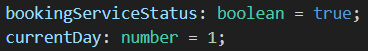
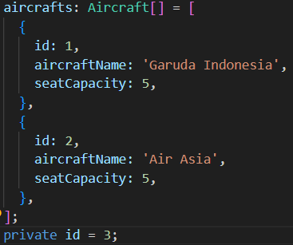
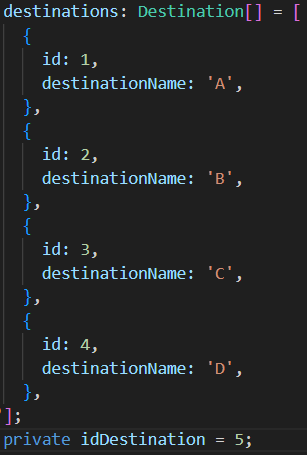
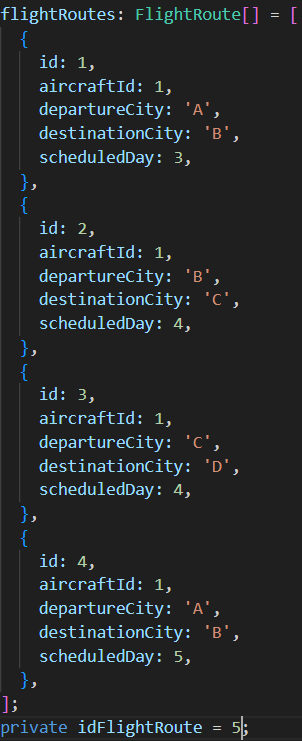

## Descriptions

Flight booking and management system that simulates operations of flight scheduling, passenger bookings, and flight executions.
Handle both direct and transit flights while maintaining accurate seat availability tracking and ensuring all passengers reach their destinations.

User Types: Admin & Passenger

Admin Features:
- Aircraft management
- Destination management
- Flight route creation
- System operations

Passenger Features:
- Flight booking
- Booking management

## Initial Data


Aircrafts:


Destinations:


Flight routes:


## Prerequisites

Ensure you have the following installed before proceeding:
- Node.js `>= v23.11.0`
- NPM `>=10.9.2`
- PNPM `>=10.9.0`

## Clone the repository

- git clone https://github.com/nowo-adi-suryo/flight-booking-and-management-system.git

## Project setup

```bash
$ pnpm install
```

## Compile and run the project

```bash
# development
$ pnpm run start

# watch mode
$ pnpm run start:dev
```

Access the website at http://localhost:3000

## License

[MIT licensed](https://github.com/nestjs/nest/blob/master/LICENSE).
